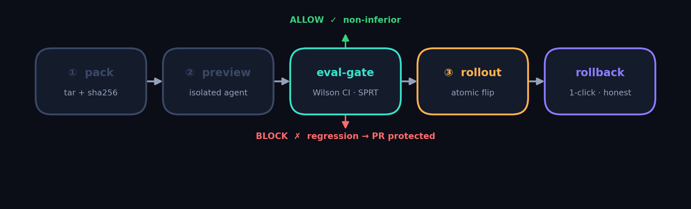
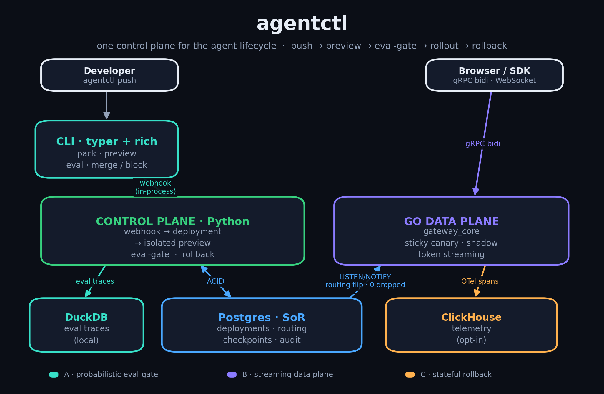

<div align="center">

# agentctl - Vercel for AI Agents

[](https://github.com/Swa-s-tik/agentctl/actions/workflows/ci.yml)

**[🌐 Live landing page →](https://swa-s-tik.github.io/agentctl/)**

**Ship an agent with one command: `agentctl push`.**
Preview deploys, statistical eval-gating, a streaming gRPC gateway, and 1-click stateful
rollback - one open-source control plane instead of five stitched-together SaaS products.

`Python control plane` · `Go data plane` · `Postgres + DuckDB` · `Apache-2.0`

</div>

---

## Why this exists

Shipping an AI agent today means gluing together a different product for each concern:
one for **evals**, one for the **proxy/router**, one for **observability**, one for
**deploys/rollbacks**. None of them share a data model, so the agent lifecycle - the thing
you actually care about - is never treated as the single distributed system it is.

`agentctl` is that system. A change to a prompt, tool schema, or execution graph flows through
**one** integrated path:

> **push → isolated preview → statistical eval-gate → canary/shadow rollout → 1-click stateful rollback**

<p align="center">
  
</p>

And it borrows the thing that made Vercel great for frontends: a deploy is **boring, instant,
and reversible** - except an agent deploy also has to reason about *non-deterministic quality*
(is the new version actually better?) and *external side-effects* (it sent emails, wrote vectors,
charged cards - those don't roll back when the code does). agentctl handles both.

## Architecture

<p align="center">
  
</p>

<details><summary>Text version of the diagram</summary>

```
        developer                         browser / SDK client
       │ agentctl push                   │ gRPC bidi · WebSocket edge
       ▼                                 ▼
 ┌───────────────┐                ┌──────────────────────────────────────────┐
 │ CLI (typer)   │                │      GO DATA PLANE  (gateway_core)         │
 │  pack + eval  │                │  sticky canary · shadow · token streaming  │
 └──────┬────────┘                │  routing ◀── Postgres LISTEN/NOTIFY ──┐    │
        │ webhook                 └───────────────┬───────────────────────┼────┘
        ▼                                         ▼ proxies Frame envelope │
 ┌──────────────────────────── CONTROL PLANE (Python) ────────────────────┼──┐
 │  webhook → register deployment → provision ISOLATED PREVIEW agent       │  │
 │  eval-gate: SPRT + Wilson CI  ·  rollback: atomic flip + checkpoints     │  │
 └───────────────┬──────────────────────────────────────────────────┬─────┘  │
                 ▼                                                    ▼        │
        ┌────────────────────┐                          ┌──────────────────┐  │
        │ Postgres (SoR)      │  deployments · routing   │ DuckDB (local)    │  │
        │ checkpoints · audit │  ◀── flip fires NOTIFY ──┘ eval traces       │  │
        └────────────────────┘                          └──────────────────┘  │
                 │ OTel spans (env-toggle)                                     │
                 ▼                                                             │
        ClickHouse (prod telemetry warehouse) ◀──────────────────────────────┘
```

</details>

- **Frozen `Frame` envelope** (`proto/`) carries text deltas, binary (vision/audio), tool calls,
  interrupts, and approvals - so the Python reference proxy and the Go data plane are **wire-compatible**:
  byte-identical on the frozen header (fields 1-4) and decode-interoperable both directions (`make conformance`).
- **Postgres** is the ACID system-of-record (coordinates + proof, never bulk state). A routing
  flip fires `pg_notify`, and the **live Go gateway re-routes instantly** - zero dropped streams.
- **DuckDB** is the embedded local OLAP store for eval traces (zero external deps).

## 5-minute quickstart

```bash
git clone https://github.com/Swa-s-tik/agentctl && cd agentctl

pip install -e .                                              # control plane + CLI
docker compose -f deploy/docker-compose.yml up -d postgres    # system-of-record
(cd agentctl/gateway_core && make build)                      # compile the Go data plane

cd examples/support_agent && agentctl push
```

That single `agentctl push` runs the **entire pipeline** and proves it on screen:

```
① pack       README.md, agent.py, prompt.yaml → commit 7ce7a54d3b08
② preview    deployment #3 · queued → building → ready · isolated agent on :57201
②′ live stream through Go data plane + side-effect
   text stream  21 TextDelta frames via the Go gateway
   arrival      first @ 33ms · last @ 639ms · spread 606ms
   buffering    none - chunks streamed incrementally
   tool call    issue_refund (side_effecting=True)
   sandbox      intercepted → mocked; real refunds issued: 0
   rollback     issue_refund sealed as side_effect/irreversible in checkpoint
   eval-gate    SPRT ALLOW @ 41/300 samples · Wilson95 [0.530, 0.804]
③ ✅ PR MERGED → promoted 100% live · https://support-agent-7ce7a54d.agents.live
```

> **What you're actually seeing.** The eval samples come from a *seeded synthetic judge* by default
> (the Wilson CI / SPRT statistics run for real on those samples) - or plug in the real `LLMJudge`
> (`pip install 'agentctl[judge]'`) to gate on actual model judgments. The **②′ stream** runs through
> the **Go gateway** when one is reachable or built, and otherwise falls back to the in-process
> **Python reference proxy** - either way you see real incremental frames and the streamed
> `issue_refund` tool call intercepted in the sandbox. Full mapping in the
> [status matrix](#status--whats-real).

Try a regression - the gate blocks it:

```bash
agentctl push --simulate-regression     # ⛔ PR BLOCKED (SPRT crosses the lower threshold)
```

### Or run the whole stack in one command

```bash
docker compose up --build        # Postgres + Go gateway + Python control plane
```

> This compiles the gateway *inside its container*. `agentctl push` streams its ②′ proof through that
> running Go gateway automatically; if no gateway is reachable it falls back to the in-process Python
> reference proxy, so the stage always runs.

## What's inside

| Concern | How agentctl does it |
|---|---|
| **Eval-gating** | A **non-inferiority gate** on a paired win/loss/tie signal - Wilson score interval decides BLOCK/ALLOW; **Wald SPRT** stops early (an inferior agent is typically blocked in well under ~100 of 1000 samples; the exact count depends on the effect size). Fixes the naïve "win-rate < 52% AND p > 0.05" rule, which is statistically backwards. |
| **Streaming gateway** | A `grpc.aio` reference proxy (the data plane that runs by default) **plus** a **source-complete Go data plane** (`make build` to compile it) behind a frozen proto: per-session sticky canary, shadow mirroring with a **bounded drop-on-full queue in both runtimes** (a slow shadow can't throttle the primary), token streaming, and a WebSocket edge where a mid-turn interrupt is a barge-in `Control` frame (stream stays open) and a client disconnect cancels the gRPC call. |
| **Progressive rollout** | `agentctl rollback rollout <commit> --weight N` rolls *forward* by percentage: a canary split (target vs current primary, shadows preserved) or a full promote - the same atomic, gateway-notifying flip as rollback. |
| **Stateful rollback** | Only the routing flip is a hard ACID transaction (atomic, `LISTEN/NOTIFY`); state realignment is per-pointer idempotent. Reversibility is **schema-enforced** - the system can't claim a payment is reversible. Real **pgvector** + Postgres event-sourced memory backends (`AGENTCTL_STATE_BACKEND=pgvector`). |
| **Multi-tenant RBAC** | Hashed **API keys** with `viewer/developer/admin/owner` roles, enforced at HTTP, gRPC, and CLI. Zero-config by default (a seeded bootstrap key); `AGENTCTL_REQUIRE_KEY=1` to enforce. |
| **Telemetry** | OTel spans → Postgres buffer by default; flip `TELEMETRY_BACKEND=clickhouse` for a **ClickHouse + Grafana** warehouse (optional `--profile telemetry` compose stack with provisioned dashboards). |
| **Wire conformance** | A golden-wire suite proves the Python proxy and the Go data plane are byte-identical on the frozen header + decode-interoperable (`make conformance`). |
| **Developer UX** | `agentctl push` - pack → preview → live eval → merge/block, with a rich live terminal. |
| **GitOps gate** | `agentctl gate --github` posts the eval-gate verdict to a PR as a **commit status** (gates merge: ALLOW → success, BLOCK → failure) + a **comment** with the per-suite Wilson CIs. Ships a reusable GitHub Action + a workflow that dogfoods it on this repo's own PRs. |
| **Status (CLI)** | `agentctl status` - the terminal view of the same unified data: deployments with eval verdict + live traffic weight + rollback honesty, recent gateway traffic by arm, and recent rollbacks. |
| **Dashboard** | `agentctl dashboard` - a server-rendered web view of the deploy lifecycle from the system-of-record: deployments, live canary/shadow weights, rollback-honesty (irreversible side effects), and **1-click rollback** wired to the real orchestrator. Zero build step (htmx). |

## Project layout

```
proto/                  frozen Frame envelope + AgentStream / ControlPlane services
agentctl/cli/           the typer CLI - `agentctl push` (cli/main.py)
agentctl/eval/          non-inferiority gate, sequential SPRT engine, judges
agentctl/gateway/       Python proxy, router, PG route cache, Go launcher
agentctl/gateway_core/  the compiled Go data plane (grpc-go, Postgres-routed)
agentctl/rollback/      Postgres schema, atomic flip, checkpoints, state stores
agentctl/control/       git webhook emulator        agentctl/runtime/  isolated previews + tool sandbox
examples/support_agent/ the flagship streaming, tool-calling example
docs/ARCHITECTURE_PRD.md  full design                tests/  demo/
```

## Status - what's real

The three verticals, the developer CLI, and the four production-hardening workstreams (multi-tenant
RBAC, real pgvector/memory state stores, ClickHouse + Grafana telemetry, a golden-wire proto
conformance suite) - plus a **Helm chart** and a **PyPI-ready wheel** - are runnable and tested. Every
addition is opt-in: a plain `docker compose up` + `agentctl push` still needs no API key, no pgvector,
and no ClickHouse. See `docs/ROADMAP_1_0.md` and `docs/design/*.md` for the deep-dives, and
`CHANGELOG.md` for the 1.0.0 notes.

For full transparency (the docs and this README say the same as the code), here's exactly what runs
on a fresh checkout vs. what's simulated or still a scaffold:

| Capability | State |
|---|---|
| Eval-gate math (Wilson CI, Wald SPRT, McNemar/Beta/BH) | **Real & unit-tested** against hand-computed scipy values |
| Atomic routing flip + schema-enforced rollback honesty | **Real & integration-tested** (advisory lock, partial-unique index, `side_effect ⇒ irreversible` CHECK) |
| RBAC (both planes), proto conformance, pgvector/Qdrant, ClickHouse/Grafana, Helm, wheel | **Real & tested** (opt-in via env/profile) |
| Python `grpc.aio` data plane | **Real** - the proxy that runs by default |
| Go data plane (`gateway_core`) | **Source-complete; compiled & conformance-checked in CI** - but the binary isn't shipped in the tree; `make build` to run it locally |
| Demo eval samples | **Simulated by default** (seeded synthetic judge) - or gate on real model judgments via `LLMJudge` (`agentctl[judge]`); a cached real-judgment fixture is gated in CI |
| Demo `issue_refund` interception ("real refunds: 0") | **Real** - the sandbox intercepts the *actual streamed* tool call and mocks it in preview, so no real refund fires |
| Bounded drop-on-full shadow queue (both runtimes) | **Real** - a slow shadow can't backpressure the primary on either the Python or the Go path |
| Header-only zero-copy forwarding (Go) | **Real (opt-in `AGENTCTL_ZEROCOPY=1`)** - routes by scanning `session_id` and tags `canary_arm` by appending to the wire bytes, no per-frame deserialize; 8.5x/30x faster on the hot ops, conformance-protected. Default path unchanged; Python proxy still deserializes |

> **Versioning note:** the package is tagged `1.0.0` to mark the roadmap complete; treat the wire,
> `StateStore`, and auth contracts as the stable surfaces. There are no external production users yet.

## Community

`CONTRIBUTING.md` (dev setup, the two-runtime tests, the proto-is-source-of-truth rule) - `GOVERNANCE.md` (roles + decision process) - `CODE_OF_CONDUCT.md` - `SECURITY.md` (private vulnerability reporting).

## License

Apache-2.0.
